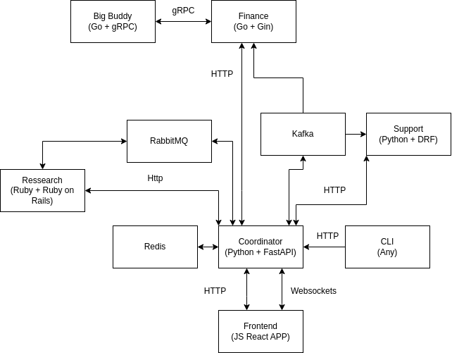

# GeekchanskiY's bench project

## Services:
1 - Coordinator
FastAPI
stores it's states
2 - Ressearch 
Ruby on Rails
3 - Finance
Gin
4 - Support
Django + DRF
5 - Frontend
React
6 - Big Guy
gRPC

## Tech stack:
    BE:
    Ruby+Rails
    Python+FastAPI
    Python+DRF
    Go+Gin
    FE:
    JavaScript+ReactJS

Frameworks and libraries:
  JS:
    React, Redux, Redux-toolkit, Formik, Yup, React-router-dom,
  Python:
    FastAPI, SQLAlchemy, Alembic, pyjwt, bcrypt, django,
    django-rest-framework
  Ruby:
    Ruby on Rails
  Go:
    Gin, GORM

# Setup guide:

export CGO_ENABLED=1

.env config:

\# Postgres fastapi
POSTGRES_DB_FASTAPI=backend_fastapi
POSTGRES_USER_FASTAPI=staffing
POSTGRES_PASSWORD_FASTAPI=staffing
POSTGRES_HOST_FASTAPI=db-fastapi

\# Postgres rails
POSTGRES_DB_RAILS=backend_rails
POSTGRES_USER_RAILS=staffing
POSTGRES_PASSWORD_RAILS=staffing
POSTGRES_HOST_RAILS=db-rails

\# Postgres general
POSTGRES_PORT=5432
POSTGRES_HOST_AUTH_METHOD=trust

\# RabbitMQ
RABBITMQ_DEFAULT_USER=rmuser
RABBITMQ_DEFAULT_PASS=rmpassword

\# zookeeper  
ALLOW_ANONYMOUS_LOGIN=yes

\# Kafka
KAFKA_BROKER_ID=1
KAFKA_ZOOKEEPER_CONNECT=zookeeper:2181
KAFKA_LISTENERS=PLAINTEXT://:9092,PLAINTEXT_HOST://:29092
KAFKA_ADVERTISED_LISTENERS=PLAINTEXT://kafka:9092,PLAINTEXT_HOST://localhost:29092
KAFKA_LISTENER_SECURITY_PROTOCOL_MAP=PLAINTEXT:PLAINTEXT,PLAINTEXT_HOST:PLAINTEXT
KAFKA_INTER_BROKER_LISTENER_NAME=PLAINTEXT
KAFKA_OFFSETS_TOPIC_REPLICATION_FACTOR=1

ALLOW_PLAINTEXT_LISTENER=yes

\# Support
DJANGO_SECRET='django-secret'

\# Coordinator
JWT_SECRET='secret'

# Services

First of all, it's a test project, so it's ok for me if something does
not work at all, or something is not implemented. The goal is to
to test different frameworks, methodologies, technologies, etc.

FastAPI service is a middleware between services.
it includes:
    kafka consumer and producer
    rabbitmq consumer and producer
    redis connection for request caching
    some descriptions for other services

Ruby on Rails service:
it includes:
    rabbitmq consumer and producer

Django app:
it includes:
    kafka consumer and producer

Gin App:
it includes:
    gRPC client
    kafka consumer and producer

React App:
    websockets and http connection
    with FastAPI

# Kafka
kafka-topics.sh --create --topic main-1 --bootstrap-server kafka:9092
kafka-topics.sh --describe --topic main-1 --bootstrap-server kafka:9092
kafka-broker-api-versions.sh --bootstrap-server localhost:9092
kafka-console-consumer.sh --topic main-1 --from-beginning --bootstrap-server kafka:9092